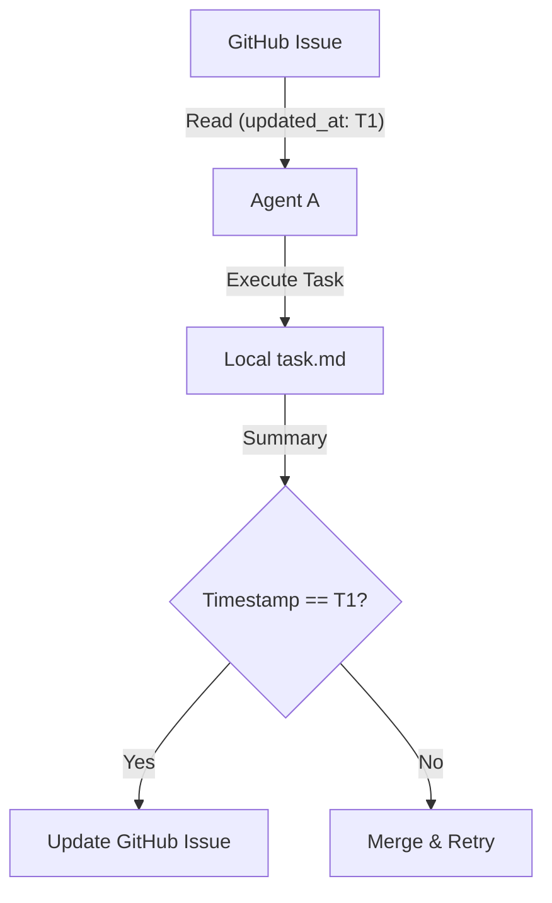
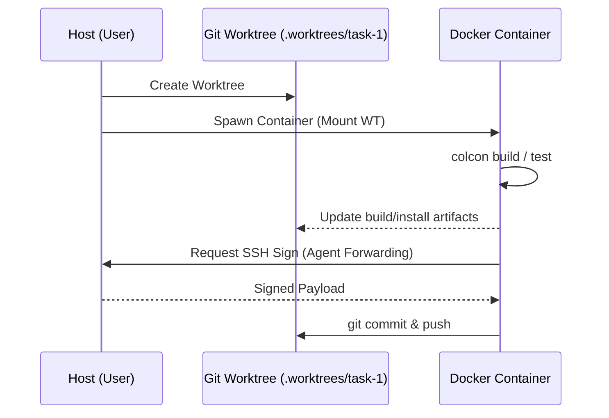

# Proposal: Multi-Agent Workflow System (RFC)

**Status**: Draft / Request for Comments
**Target**: Project11 / ROS 2 Agent Workspace

## 1. Executive Summary
We propose a **Multi-Agent Development Environment** enabling:
1.  **Parallel Execution**: Agents work on independent tasks simultaneously.
2.  **Phased Development**: Explicit Planning, Implementation, and Verification stages.
3.  **Cross-Agent Verification**: Dedicated review loops between diverse AI models.

## Table of Contents
1. [Executive Summary](#1-executive-summary)
2. [Memory Architecture](#2-memory-architecture-source-of-truth-vs-working-memory)
3. [Parallelism: Isolation Strategy](#3-parallelism-the-isolation-strategy)
4. [Ecosystem: Review Loop](#4-ecosystem-the-cross-agent-review-loop)
5. [Cleanup & Simplification](#5-cleanup--simplification-full-workspace-audit)
6. [Gaps & Technical Challenges](#6-gaps--technical-challenges-to-be-solved)
7. [Adaptive QA Strategy](#7-adaptive-quality-assurance-strategy)
8. [ROS 2 Workspace Specifics](#8-ros-2-workspace-specifics)
9. [Terminology & Glossary](#9-terminology--glossary-mechanism)
10. [Autonomy & Validation Handshake](#10-autonomy--validation-handshake)
11. [Metrics & Success Criteria](#11-metrics--success-criteria)
12. [Migration & Compatibility](#12-migration--compatibility)
13. [Next Steps](#13-next-steps)

## 2. Memory Architecture

### Challenge
Agents are ephemeral and lose context between sessions. We require persistence across VS Code, CLI, and Codespaces.

### Solution: Dual-Layer Memory
*   **Layer 1: Long-Term (GitHub Issues)**
    *   **Role**: Absolute Source of Truth (Goals, Decisions, Status).
    *   **Access**: Read/Write for all agents.
*   **Layer 2: Working Memory (Local `task.md`)**
    *   **Role**: Low-latency, granular task tracking.
    *   **Lifecycle**:
        1. Agent picks up Issue #123.
        2. Agent tracks detailed progress in `.worktrees/issue-123/task.md`.
        3. Agent periodically summarizes `task.md` back to the GitHub Issue.
    *   **UI**: Pinned in IDE; simple text file in CLI.

### Conflict Resolution (Optimistic Locking)
To prevent race conditions:
1.  **Read**: Store `updated_at` timestamp.
2.  **Verify**: Re-check Issue before writing.
3.  **Merge**: If changed, merge local `task.md` with remote before push.

### Architecture Diagram: Memory Flow

## 3. Parallelism & Isolation

### Challenge
ROS 2 builds conflict when sharing the same workspace directory.

### Strategy
> [!IMPORTANT]
> We combine **Worktrees** (code isolation) with **Docker** (environment isolation) to enable interference-free parallel work.

### 3.1. Execution Modes
1.  **Sandbox Mode (Default)**: Agent runs inside a Docker container. Host files are mounted as Volumes.
2.  **Host Mode (Optional)**: Agent runs directly on the host (e.g., for local debugging). All commands MUST be confirmed by the human user.

### 3.2. Security: SSH Forwarding
*   **Mechanism**: Pass `-v $SSH_AUTH_SOCK:/ssh-agent` to container.
*   **Benefit**: Containers push code using host credentials without storing private keys.

### 3.3. Isolation Diagram

1.  **Source (Git)**: Agents create `.worktrees/task-123`.
2.  **Runtime (Docker)**:
    *   Agent spins up a **Disposable Container**.
    *   **Mounts**: Read-Only Underlay (`~/ws/core_ws`), Read-Write Task Worktree.
3.  **Benefits**:
    *   **Safety**: Cannot delete host system files.
    *   **Cleanliness**: No usage of host `.bashrc`.
    *   **Consistency**: Fresh, known-good environment state.

## 4. Ecosystem: Cross-Agent Review

### 4.1. Agent-to-Agent Review
1.  **Submission**: Agent A (Implementer) pushes `feature/task-123` and opens a PR.
2.  **Trigger**:
    *   **Manual**: User asks Agent B (Reviewer) to "Check PR #123".
    *   **Automated**: GitHub Action triggers a "Review Agent" (via webhook or scheduled job).
3.  **Review Execution**:
    *   Agent B reads the *diff* (using `mcp_github` or `git diff main...feature/task-123`).
    *   Agent B validates against `CONTRIBUTING.md` and `AGENTS.md` rules.
4.  **Feedback Delivery**:
    *   Agent B uses `mcp_github` to post **Inline Comments** on the PR.
    *   *Why?* Because this is the universal "Review Interface" that users and other agents already understand.
5.  **The Response Loop**:
    *   Agent A wakes up, reads the PR comments.
    *   Agent A updates its local `task.md`:
        *   `[ ] Address comment on line 42 (Memory leak)`
    *   Agent A fixes code, commits, and resolves the conversation.

### 4.2. Human-in-the-Loop
Humans are not just observers; they are active participants.
*   **Manual Override**: A human can always pause an agent, comment on a PR, or reject a plan.
*   **Direct Debugging**: If an agent gets stuck, a human can attach to the agent's container (see Sec 6.4) to diagnose the issue directly.

## 5. Cleanup & Simplification: Full Workspace Audit

> "Can we do the same for other files and directories in the workspace?"

We will expand the audit to the **Entire Workspace**, categorizing every file/folder into:
1.  **Core**: Essential for ROS 2 (e.g., `src/`, `package.xml`).
2.  **Agent Logic**: Essential for AI (e.g., `.agent/scripts/setup.sh`).
3.  **Legacy/Noise**: To be deleted or archived.

*Example Audit Plan:*
*   `configs/` -> Are all `.repos` files still used?
*   `ag_work/` (if exists) -> Temp files to clean?
*   `.agent/rules/` -> Are these rules actually followed?

## 6. Gaps & Technical Challenges (To Be Solved)

### 6.1. Retrospectives (Meta-Learning)
*   **Gap**: Agents fixing code is good, but agents fixing *rules* is better.
*   **Solution**: A **"Retrospective" Workflow** runs when a Task is marked `Done`.
    *   It analyzes PR comments: "Did we violate a rule?"
    *   It proposes updates to `CONTRIBUTING.md` or `.agent/rules/` to prevent recurrence.

### 6.2. Secret Management
*   **Gap**: Docker containers need git access.
*   **Solution**: Use `ssh-agent` forwarding or strict Volume Mounts for keys. *Never* write secrets to the container filesystem.

### 6.3. Resource Governance
*   **Gap**: Concurrent builds exhaust RAM (OOM).
*   **Solution**: **Resource Sentinel** limits concurrent builds.

### 6.4. Human Debuggability
*   **Gap**: How to fix a broken agent container?
*   **Solution**: Standardize a `make attach-task-123` command to drop a human shell instantly into the agent's environment.

### 6.5. Dependency Drift
*   **Gap**: Agents `pip install` packages in Docker but forget `package.xml`.
*   **Solution**: A CI check (or Pre-Commit hook) that fails if imported modules are missing from `package.xml`.

## 7. Adaptive Quality Assurance Strategy

> "Let's keep it flexible... depending on the task, the development method will vary."

Instead of enforcing a rigid "One Size Fits All" TDD policy, we propose an **Adaptive Strategy**. The *Reviewer Agent* will determine the appropriate testing method based on the Task Type.

### 7.1. The Menu of Methodologies

#### Option A: Test-Driven Development (TDD)
*   **Best For**: Pure logic libraries, algorithms, utilities (e.g., `calc_distance()`, `path_smoother`).
*   **Workflow**: Red-Green-Refactor (Unit Tests).

#### Option B: Simulation-First Verification
*   **Best For**: Robotics behaviors, Navigation, Control loops.
*   **Workflow**:
    1.  Define the Scenario (e.g., "USV must drive through the gate").
    2.  Write the Code.
    3.  Verify success in Gazebo/Ignition.

#### Option C: Contract-Driven Development
*   **Best For**: Node integration, large system architecture.
*   **Workflow**:
    1.  Define the ROS 2 Interface (`.msg`, `.action`).
    2.  Implement the Node.
    3.  Verify purely that the node "Speaks the right language" (Topics/Types match).

#### Option D: Property-Based Testing
*   **Best For**: Message serialization, complex coordinate transforms, robust parsing.
*   **Workflow**: Define invariants (e.g., "quaternion magnitude is always 1") and fuzz-test inputs.

### 7.2. Enforcement
The **Reviewer Agent** does not enforce "Unit Tests" blindly. Instead, it asks: **"Did you verify this work in a way that matches its complexity?"**
*   If you wrote a Math library, show me `gtest`.
*   If you wrote a Wall Follower, show me a Rosbag or Sim Screenshot.

## 8. ROS 2 Workspace Specifics
We must formalize the definition of "Project" vs "Workspace" to avoid agent confusion.

1.  **Underlay/Overlay Structure**:
    *   **Underlay**: Pre-built dependencies (e.g., `/opt/ros/jazzy` + common libs). Agents **READ** but **DO NOT MODIFY**.
    *   **Project Overlay**: The active development layer (user's code). Agents **MODIFY** this.
2.  **Multi-Distro Support**:
    *   The workspace handles multiple ROS 2 distributions (e.g., Jazzy, Rolling) via branch-based or docker-based switching. Agents must query the active distro before generating code.

## 9. Terminology & Glossary Mechanism
To prevent communication breakdowns, we propose a standardized **Living Glossary**.

*   **Mechanism**: A file `.agent/GLOSSARY.md` will exist in the workspace root.
*   **Rule**: Agents MUST consult this glossary when encountering ambiguous terms.
*   **Key Definitions (Initial Set)**:
    *   **Project**: The target ROS 2 software (the user's IP - e.g., `src/unh_marine_autonomy`).
    *   **Workspace**: The scaffolding, scripts, and agent tools wrapping the Project (e.g., `ros2_agent_workspace`).

## 10. Autonomy & Validation Handshake
To build trust and ensure architectural alignment:

1.  **Architecture Report**: After planning, the agent generates `ARCH_DECISIONS.md` detailing patterns and class structures.
2.  **Review Gateway**: Execution is blocked until a human or senior agent adds an `[Approved]` tag.
3.  **Manager Summary**: A "Manager Agent" aggregates daily activity into a high-level executive report.

## 11. Metrics & Success Criteria
*   **Cycle Time**: Duration from "Issue Open" to "PR Merged".
*   **Build Reliability**: Rate of successful `colcon build` passes in Sandbox Mode.
*   **Review Ratio**: Number of "Request Changes" vs. "Approvals" on Agent-led PRs.

## 12. Migration & Compatibility
*   **Opt-in Model**: The new workflow is triggered only for issues labeled `agent-task`.
*   **Co-existence**: Static `src/` builds remain unchanged; worktrees exist only in `.worktrees/` (gitignored).

## 13. Next Steps
1.  **Post as Issue**: We will post this entire text as a GitHub Issue on `ros2_agent_workspace`.
2.  **Community Review**: We (Agents & Humans) will discuss in the Issue comments.
3.  **Pilot**: Implement the `Resource Sentinel` and `SSH Forwarding` first to validate the safety model.

